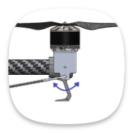
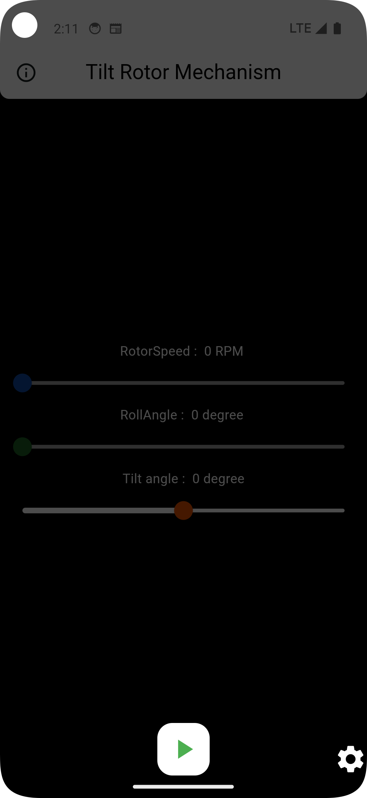
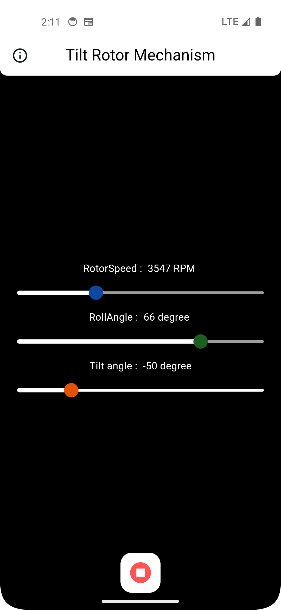
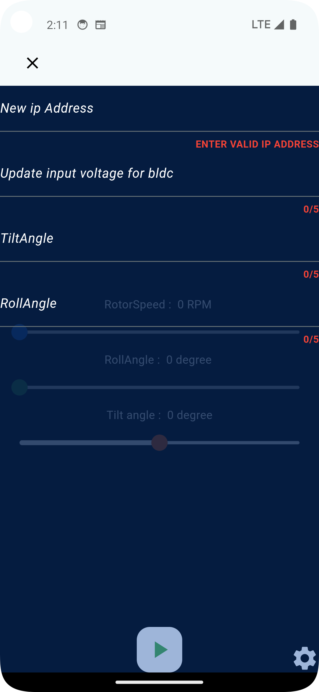

# DLP (Dynamic Lift Propeller Control)

**Created By:** Shubham Choudhary  

DLP is an advanced IoT-based application designed to control and monitor the speed and angle of a tilt rotor in real time. Utilizing local WebSocket communication, the app ensures precise and reliable adjustments for efficient operations.

App Screenshots
--------

  
  
  

## Features

- **Tilt Rotor Control**:
  - Adjust the **speed** and **angle** of the rotor dynamically.
  - Real-time monitoring of rotor parameters.

- **Local Communication**:
  - Communicates with the tilt rotor using **local WebSocket** for efficient data exchange.

- **IoT Integration**:
  - Designed for seamless integration with IoT-enabled tilt rotor systems.
  - Remote control and monitoring capabilities.

- **Data Persistence**:
  - Stores user configurations and operational logs locally for offline access.

- **Cross-Platform Support**:
  - Built with **Dart**, ensuring compatibility across Android and iOS devices.

## Technology Stack

- **Dart**: Core programming language for application development.
- **WebSocket**: Enables fast and reliable local communication with the tilt rotor system.
- **SharedPreferences**: Ensures local storage of configurations and logs for offline use.
- **IoT**: Provides real-time control and monitoring for tilt rotor systems.

## Installation and Setup

1. Clone the repository to your local machine.
2. Navigate to the project directory.
3. Run `flutter pub get` to install dependencies.
4. Configure WebSocket parameters to match the tilt rotor system.
5. Deploy the app on a compatible device.

## Usage

- Connect the app to the tilt rotor system via **local WebSocket**.
- Use the control panel to adjust the **speed** and **angle** of the rotor.
- Monitor the performance of the rotor in real time.
- Save configurations locally for repeated use or offline operations.

## Future Enhancements

- Support for multiple tilt rotor systems in a single application.
- Integration with advanced IoT analytics tools for enhanced performance monitoring.
- Addition of pre-defined operation modes for easier control.

---

**Developed By:** Shubham Choudhary
